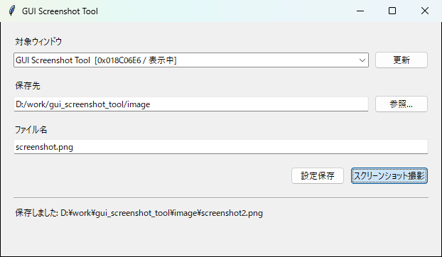

# GUI Screenshot Tool

Windowsアプリのウィンドウだけを撮影し、覚えておいた場所へ同じファイル名で
上書き保存するツールです。README用スクリーンショットを手動で切り抜かずに
更新できます。



## 機能

- 起動中のトップレベルウィンドウをタイトル、ハンドル、状態付きで一覧表示
- 選択したウィンドウだけを撮影（最小化中は誤った画像を防ぐため撮影不可）
- 保存先とファイル名を `%APPDATA%\gui_screenshot_tool\settings.json` に保存
- 保存先ディレクトリを必要に応じて自動作成し、確認なしで上書き
- GUIでいつでも対象ウィンドウ、保存先、ファイル名を変更
- 保存済み設定を使ったワンコマンド撮影
- 登録したコマンドからGUIアプリを起動し、ウィンドウ検出後に自動撮影
- 起動したPIDのウィンドウを優先し、完全一致・部分一致でタイトルを検索
- 撮影後の正常終了、タイムアウト後の強制終了、終了しない設定に対応
- 自動撮影の進行状況とエラーを画面内ログへ表示
- `01_`、`02_` の連番を付け、既存画像を上書きせずに保存
- 拡張子の前に撮影日または撮影日時を追加（排他選択）

## 動作環境

- Windows 10 / 11
- Python 3.13

## セットアップ

PowerShellでリポジトリを開き、仮想環境へインストールします。

```powershell
py -3.13 -m venv .venv
.\.venv\Scripts\Activate.ps1
python -m pip install -e .
```

開発ツールも入れる場合:

```powershell
python -m pip install -e ".[dev]"
```

### Windows EXEのビルド

PyInstallerを含むビルド用依存関係をインストールし、specファイルから
コンソールなしの単体実行EXEを生成します。

```powershell
python -m pip install -e ".[build-exe]"
pyinstaller --clean --noconfirm gui_screenshot_tool.spec
```

成果物は `dist\gui_screenshot_tool.exe` です。EXEはPythonを別途インストール
していないWindows環境でも起動できます。初回起動時はone-file形式の内容を
一時ディレクトリへ展開するため、通常より起動に時間がかかる場合があります。
`version_info.txt` から製品名とバージョン情報を埋め込みます。

## 使い方

GUIを起動します。

```powershell
python main.py
```

一覧から対象ウィンドウを選び、保存先とファイル名を入力して「設定保存」を
押します。「スクリーンショット撮影」は現在の設定を保存してから撮影します。
「更新」で起動後のウィンドウを一覧へ反映できます。

設定変更時も同じGUIを開きます。

```powershell
python main.py --configure
```

一度設定した後はGUIなしで撮影できます。

```powershell
python main.py --capture
```

インストール後は `gui-screenshot-tool` コマンドも利用できます。

### 自動撮影

1. 「設定管理」タブで「新規登録」を押します。
2. 実行コマンド、作業ディレクトリ、引数、対象ウィンドウ、待機時間、
   保存先、終了方法を入力して保存します。
3. 「自動撮影」タブで登録済み設定を選び、「起動して撮影」を押します。
4. 起動、ウィンドウ検出、撮影、保存、終了の結果を実行ログで確認します。

「ウィンドウ名取得」は現在表示中のトップレベルウィンドウからタイトルを
選択できます。「テスト起動」はコマンドと作業ディレクトリを確認するために
アプリを起動し、終了せずに残します。

自動撮影は別スレッドで実行されるため、ウィンドウ待機中や追加待機中もGUIを
操作できます。同時に実行できる自動撮影は1件です。

保存先ディレクトリがない場合は、撮影時または「保存先を開く」操作時に自動で
作成します。連番を使わない場合、同名ファイルは確認せず上書きします。

手動撮影と自動撮影設定では、次のファイル名オプションを個別にON/OFFできます。

- 連番: `01_main_window.png`、`02_main_window.png`
- 現在日付: `main_window_20260810.png`
- 現在日時: `main_window_20260810143025.png`
- 連番＋日時: `01_main_window_20260810143025.png`

連番をONにした場合は既存ファイルの最大番号に1を加えるため、上書きしません。
日付と日時は「なし／日付／日時」から1つだけ選択できます。
連番がOFFの場合は従来どおり同名ファイルを上書きします。

## 設定ファイル

設定はユーザーごとに次の場所へUTF-8 JSONとして保存されます。

```text
%APPDATA%\gui_screenshot_tool\settings.json
```

```json
{
  "apps": {
    "default": {
      "window_title": "compare_tool",
      "output_directory": "C:\\work\\compare_tool\\docs\\images",
      "filename": "main_window.png",
      "add_sequence_number": false,
      "add_timestamp": false,
      "add_date": false
    }
  },
  "auto_capture_profiles": {
    "compare_tool": {
      "name": "compare_tool",
      "command": "C:\\work\\compare_tool\\.venv\\Scripts\\pythonw.exe",
      "working_directory": "C:\\work\\compare_tool",
      "arguments": "main.py",
      "window_title": "compare_tool",
      "title_match_mode": "exact",
      "startup_timeout_seconds": 30.0,
      "capture_delay_seconds": 1.0,
      "output_directory": "C:\\work\\compare_tool\\docs\\images",
      "filename": "main_window.png",
      "add_sequence_number": true,
      "add_timestamp": true,
      "add_date": false,
      "close_after_capture": true,
      "exit_mode": "graceful_then_force",
      "shutdown_timeout_seconds": 5.0
    }
  }
}
```

ウィンドウハンドルは起動ごとに変わるため保存せず、撮影時にタイトルから
ウィンドウを探し直します。完全一致を優先し、見つからない場合は部分一致を
使用します。

自動撮影では、今回起動したプロセスIDとタイトルが一致するウィンドウを優先
します。ランチャーが別プロセスとしてGUIを起動する場合など、同じPIDの候補が
ないときはタイトルが一致する表示中のウィンドウへフォールバックします。

`title_match_mode` は `exact`（完全一致）または `partial`（部分一致）です。
`add_sequence_number`、`add_date`、`add_timestamp` はそれぞれ連番、現在日付、
現在日時の付加を表す真偽値です。`add_date` と `add_timestamp` は同時に `true`
にはできません。既存の設定ファイルにキーがない場合は `false` として読み込みます。
`exit_mode` は次のいずれかです。

- `graceful`: 正常終了要求のみ
- `graceful_then_force`: 正常終了要求後、終了待機時間を超えたら強制終了
- `leave_running`: アプリを終了しない

## 注意点

- 対象ウィンドウは最小化を解除してから撮影してください。
- DRM保護、管理者権限、GPU描画方式などにより `PrintWindow` を拒否する
  アプリは撮影できない場合があります。
- 自動撮影で同名ウィンドウが複数ある場合は、起動したPID、完全一致、面積の
  順に優先します。手動撮影のCLIでは最初に見つかったものを撮影します。
- GUIで選べるのはタイトルのある表示中のトップレベルウィンドウです。
- 管理者として起動したアプリを操作する場合、本ツールにも同等の権限が必要な
  ことがあります。

### `No module named 'win32gui'` が表示される場合

ツールマネージャや仮想環境から起動すると、通常のターミナルとは別のPythonが
使われることがあります。エラーダイアログに表示された「実行中のPython」を
使って依存関係をインストールしてください。

```powershell
& "C:\path\to\python.exe" -m pip install -e "D:\work\gui_screenshot_tool"
```

ツールマネージャには、依存関係をインストールしたPythonの絶対パスを実行
コマンドとして設定するのが確実です。

## 自動撮影の手動確認

1. 撮影対象のGUIアプリを終了した状態で、自動撮影設定を登録する
2. 「テスト起動」でコマンドと作業ディレクトリが正しいことを確認する
3. 「起動して撮影」で対象ウィンドウが検出され、指定先へ保存されることを確認する
4. 正常終了、強制終了、終了しない、の各終了方法を確認する
5. 実行コマンドを存在しないパスへ変え、エラーがログとダイアログへ出ることを確認する
6. ウィンドウタイトルを存在しない値へ変え、最大待機後に失敗することを確認する
7. 同名ウィンドウを先に起動し、今回起動したPIDのウィンドウが優先されることを確認する
8. 存在しない保存先を指定し、ディレクトリ作成と画像保存を確認する
9. 待機中もタブ切り替えやウィンドウ移動ができ、GUIがフリーズしないことを確認する

## 開発

```powershell
ruff check .
ruff format --check .
pytest
```

`config`、`windows`、`capture`、`automation`、`service`、`gui`、`cli` を分離しています。
撮影形式、複数プロファイル、待機時間、一括撮影などを各層へ追加しやすい構成です。

## License

[MIT License](LICENSE)
