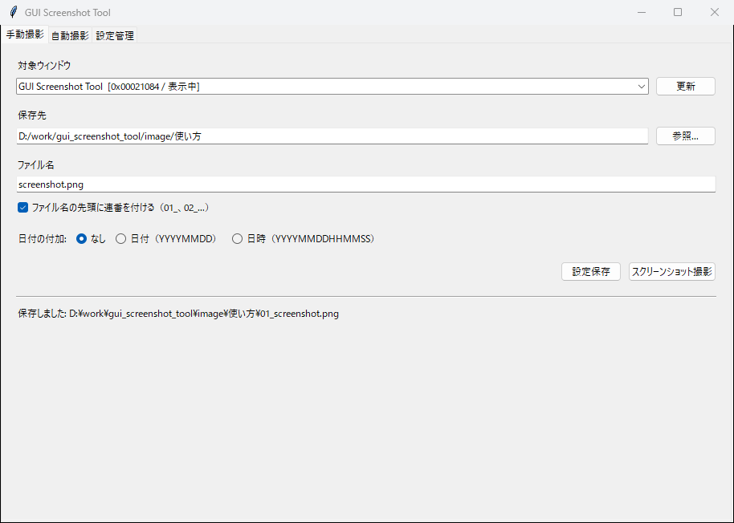
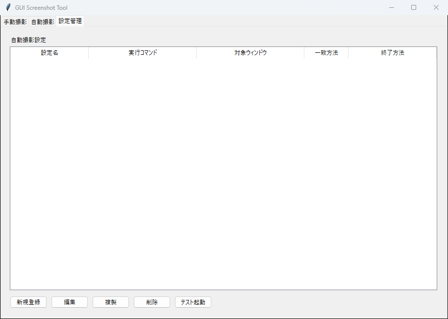
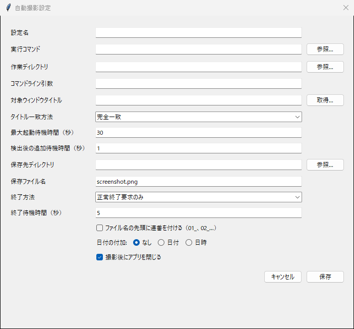
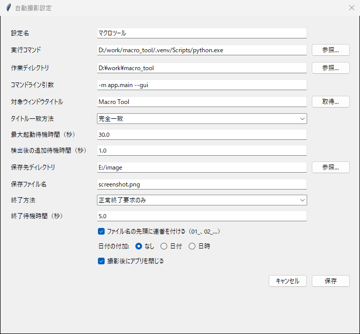
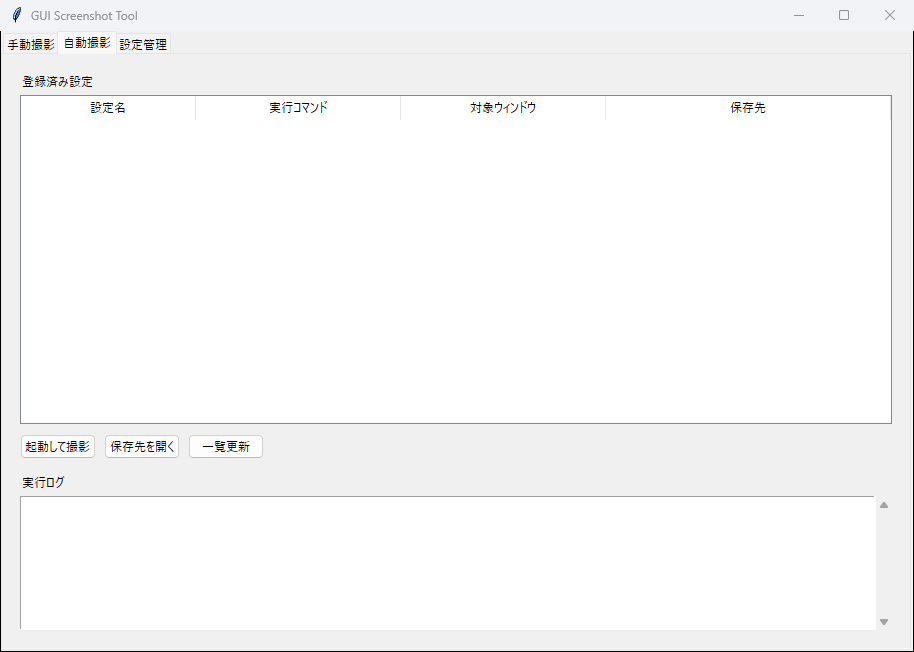
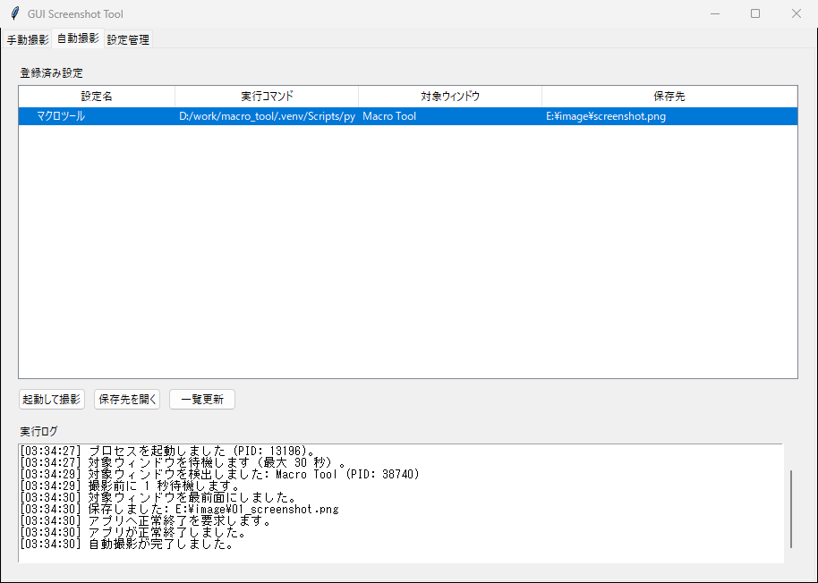

# GUI Screenshot Tool 詳しい使い方

GUI Screenshot Toolは、Windowsアプリのウィンドウだけを画像として保存する
ツールです。毎回同じ保存先・ファイル名で撮影できるほか、登録したGUIアプリを
起動して、ウィンドウの表示を待ってから自動撮影することもできます。

このページでは、配布版の `gui_screenshot_tool.exe` を使う場合を中心に説明します。

## 1. 動作環境と起動

- 対応OS: Windows 10 / 11
- インターネット接続: 不要
- Python: EXE版ではインストール不要

ダウンロードしたファイルを展開し、`gui_screenshot_tool.exe` をダブルクリック
してください。

配布版にはデジタル署名がないため、Windows SmartScreenが表示される場合が
あります。入手元とファイル名を確認したうえで、「詳細情報」から実行してください。

初回起動時は、EXEの内容を一時フォルダへ展開するため、画面が表示されるまで
少し時間がかかる場合があります。

## 2. 画面構成

画面上部には3つのタブがあります。

- 「手動撮影」: 現在起動しているウィンドウを選んで撮影します。
- 「自動撮影」: 登録済み設定からアプリの起動・撮影・終了を実行します。
- 「設定管理」: 自動撮影設定の新規登録、編集、複製、削除を行います。

## 3. 手動でスクリーンショットを撮影する



### 3.1 対象ウィンドウを選ぶ

1. 撮影したいアプリを起動します。
2. 「手動撮影」タブを開きます。
3. 「更新」を押します。
4. 「対象ウィンドウ」から撮影対象を選びます。

一覧には、ウィンドウタイトル、ハンドル、表示状態が表示されます。新しく開いた
ウィンドウやダイアログが見つからない場合は、もう一度「更新」を押してください。

最小化中のウィンドウは正しく撮影できないため、元のサイズへ戻してから撮影します。

### 3.2 保存先とファイル名を指定する

「保存先」へ画像を保存するフォルダを入力します。「参照…」からフォルダを
選ぶこともできます。存在しないフォルダは撮影時に自動作成されます。

「ファイル名」には拡張子を含めて入力します。対応形式は次のとおりです。

- PNG: `screenshot.png`
- JPEG: `screenshot.jpg` または `screenshot.jpeg`
- WebP: `screenshot.webp`

### 3.3 連番・日付を指定する

「ファイル名の先頭に連番を付ける」をONにすると、既存ファイルを上書きせず、
保存先にある最大番号の次で保存します。

```text
01_screenshot.png
02_screenshot.png
03_screenshot.png
```

「日付の付加」は次の3つから1つだけ選択できます。

- なし: `screenshot.png`
- 日付: `screenshot_20260811.png`
- 日時: `screenshot_20260811153045.png`

連番と日時を組み合わせた場合は、次の形式になります。

```text
01_screenshot_20260811153045.png
```

連番をOFFにした場合、同じファイル名の画像は確認なしで上書きされます。

### 3.4 設定保存と撮影

- 「設定保存」: 対象タイトル、保存先、ファイル名、ファイル名オプションを保存します。
- 「スクリーンショット撮影」: 現在選択しているウィンドウを撮影します。

保存に成功すると、画面下部と完了ダイアログへ保存したフルパスが表示されます。

## 4. 自動撮影設定を登録する



「設定管理」タブを開き、「新規登録」を押します。

登録後は、この画面から次の操作ができます。

- 「編集」: 選択した設定を変更します。
- 「複製」: 選択した設定をコピーして新しい設定を作ります。
- 「削除」: 選択した設定を削除します。
- 「テスト起動」: コマンドと作業ディレクトリを使ってアプリだけを起動します。

「テスト起動」では撮影や自動終了は行いません。起動したアプリは手動で終了して
ください。

## 5. 自動撮影設定の各項目



### 設定名

一覧で見分けるための名前です。対象アプリ名や撮影する画面名を付けます。

例: `マクロツール メイン画面`

### 実行コマンド

起動するEXE、またはPythonの実行ファイルを指定します。「参照…」から選択できます。

EXEを直接起動する例:

```text
D:\work\macro_tool\macro_tool.exe
```

Pythonアプリを仮想環境から起動する例:

```text
D:\work\macro_tool\.venv\Scripts\python.exe
```

Pythonアプリの場合、`main.py` ではなくPython本体を「実行コマンド」に指定し、
起動するモジュールやスクリプトは「コマンドライン引数」に指定するのが確実です。

### 作業ディレクトリ

アプリを起動するときのカレントディレクトリです。設定ファイルや画像を相対パスで
読むアプリでは、通常はプロジェクトまたはEXEが置かれたフォルダを指定します。

存在しないディレクトリは指定できません。

### コマンドライン引数

実行コマンドへ渡す引数です。引数が不要な場合は空欄にします。

モジュールを起動する例:

```text
-m app.main --gui
```

空白を含む値はダブルクォートで囲みます。

```text
--config "D:\work files\settings.json"
```

### 対象ウィンドウタイトル

撮影するウィンドウのタイトルです。「取得…」を押すと、現在起動中のウィンドウ
一覧から選択できます。

設定画面やダイアログを撮影する場合は、対象画面を開いた状態で「取得…」を押します。

### タイトル一致方法

- 「完全一致」: ウィンドウタイトル全体が設定値と同じ場合だけ対象にします。
- 「部分一致」: ウィンドウタイトルに設定値が含まれていれば対象にします。

誤検出を避けるには完全一致がおすすめです。編集中のファイル名などでタイトルが
変化するアプリでは部分一致を利用してください。

同名ウィンドウが既にある場合は、今回起動したプロセスIDのウィンドウを優先します。

### 最大起動待機時間（秒）

アプリ起動後、対象ウィンドウが見つかるまで待つ最大時間です。初期値は30秒です。
重いアプリでは長めに設定してください。

固定時間後に無条件で撮影するのではなく、この時間内で対象ウィンドウを定期的に
検索します。

### 検出後の追加待機時間（秒）

対象ウィンドウを検出してから撮影するまでの待機時間です。初期値は1秒です。
画面の描画やデータ読み込みに時間がかかるアプリでは長めに設定します。

### 保存先ディレクトリ・保存ファイル名

撮影画像の保存場所とファイル名です。保存先が存在しない場合は自動作成されます。
ファイル名の形式、連番、日付・日時の規則は手動撮影と同じです。

### 終了方法・終了待機時間

- 「正常終了要求のみ」: ウィンドウへ閉じる要求を送り、終了しなければエラーにします。
- 「正常終了後に強制終了」: 閉じる要求後、終了待機時間を超えた場合だけ強制終了します。
- 「終了しない」: 撮影後もアプリを起動したままにします。

「撮影後にアプリを閉じる」がOFFの場合も、アプリを起動したままにします。

未保存確認ダイアログを表示するアプリでは正常終了が完了しない場合があります。
強制終了すると対象アプリの未保存データが失われる可能性があるため、必要な場合だけ
「正常終了後に強制終了」を選択してください。

### ファイル名オプション

- 連番: ファイル名の先頭へ `01_`、`02_` の番号を追加します。
- 日付: 拡張子の前へ `YYYYMMDD` を追加します。
- 日時: 拡張子の前へ `YYYYMMDDHHMMSS` を追加します。

日付と日時はラジオボタンのため、同時には選択できません。

## 6. 設定例



Python製GUIアプリを起動する設定例です。

```text
設定名: マクロツール
実行コマンド: D:\work\macro_tool\.venv\Scripts\python.exe
作業ディレクトリ: D:\work\macro_tool
コマンドライン引数: -m app.main --gui
対象ウィンドウタイトル: Macro Tool
タイトル一致方法: 完全一致
最大起動待機時間: 30秒
検出後の追加待機時間: 1秒
保存先ディレクトリ: E:\image
保存ファイル名: screenshot.png
終了方法: 正常終了要求のみ
終了待機時間: 5秒
```

入力後に「保存」を押します。設定名が既に存在する場合は上書き確認が表示されます。

## 7. 登録設定から起動して撮影する



1. 「自動撮影」タブを開きます。
2. 一覧から実行する設定を選択します。
3. 「起動して撮影」を押します。

自動撮影中も画面はフリーズしません。同時に実行できる自動撮影は1件です。

「保存先を開く」を押すと、選択した設定の保存先をエクスプローラーで開きます。
「一覧更新」を押すと、設定管理で追加・変更した内容を再読み込みします。

## 8. 実行ログを確認する



実行ログには次の処理が時刻付きで表示されます。

1. コマンドの実行
2. 起動したプロセスID
3. 対象ウィンドウの待機
4. 検出したウィンドウタイトルとプロセスID
5. 追加待機
6. 最前面への移動
7. 保存した画像のフルパス
8. アプリの終了結果

途中で失敗した場合は、実行ログとエラーダイアログの両方に原因が表示されます。

## 9. 設定ファイル

設定はWindowsユーザーごとに、次のJSONファイルへ保存されます。

```text
%APPDATA%\gui_screenshot_tool\settings.json
```

設定をバックアップしたい場合は、このファイルをコピーしてください。設定を初期化
する場合は、GUI Screenshot Toolを終了してからファイルを別の場所へ移動します。

EXEを削除しても設定ファイルは自動削除されません。

## 10. 困ったときは

### 対象ウィンドウが一覧にない

- 対象アプリやダイアログが画面に表示されているか確認します。
- 最小化を解除します。
- 「更新」を押します。
- 管理者権限で起動したアプリの場合、本ツールも管理者として起動します。

### 自動撮影で対象ウィンドウが見つからない

- 「テスト起動」でアプリが起動するか確認します。
- ウィンドウタイトルを「取得…」から選び直します。
- タイトルが変化する場合は「部分一致」を試します。
- 最大起動待機時間を長くします。
- スプラッシュ画面ではなく、撮影したい本画面のタイトルを指定します。

### 画面の描画途中で撮影される

「検出後の追加待機時間」を長くしてください。

### アプリを正常終了できない

対象アプリが未保存確認や終了確認を表示していないか確認します。確認操作が必要な
アプリでは、「終了しない」を選んで手動終了する方法が安全です。

### スクリーンショットが真っ黒になる

DRM保護、管理者権限、GPU描画方式などにより、アプリがWindowsの `PrintWindow`
を拒否する場合があります。本ツールと対象アプリの権限を合わせても改善しない場合、
そのアプリはウィンドウ単位の自動撮影に対応できない可能性があります。

### 保存できない

- 保存先への書き込み権限を確認します。
- ファイル名に `\ / : * ? " < > |` を使用していないか確認します。
- 対応拡張子が `.png`、`.jpg`、`.jpeg`、`.webp` のいずれかか確認します。

## 11. 終了とアンインストール

GUI Screenshot Toolの右上にある閉じるボタンで終了します。

EXE版をアンインストールする場合は、`gui_screenshot_tool.exe` を削除します。保存済み
設定も不要な場合は、次のフォルダを手動で削除してください。

```text
%APPDATA%\gui_screenshot_tool
```

撮影した画像は削除されません。
